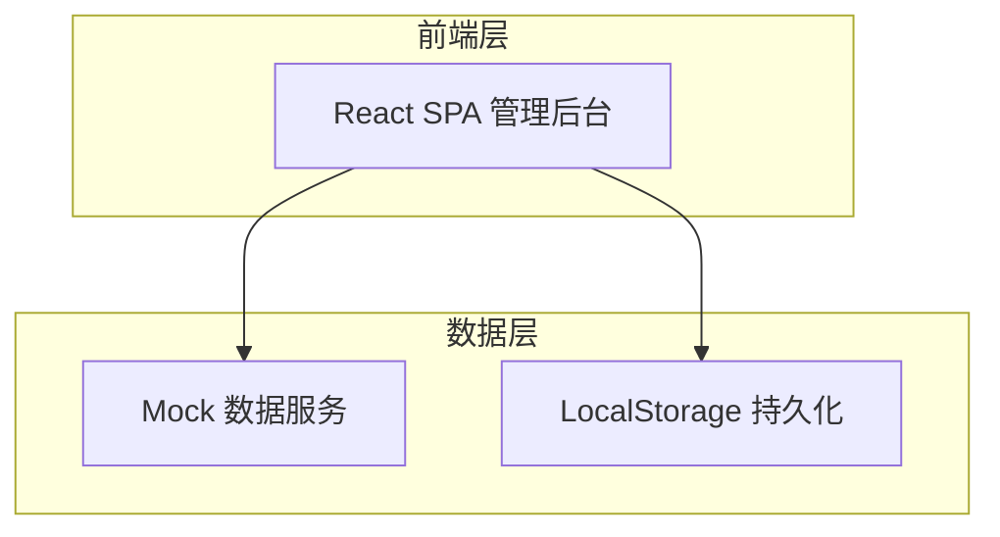
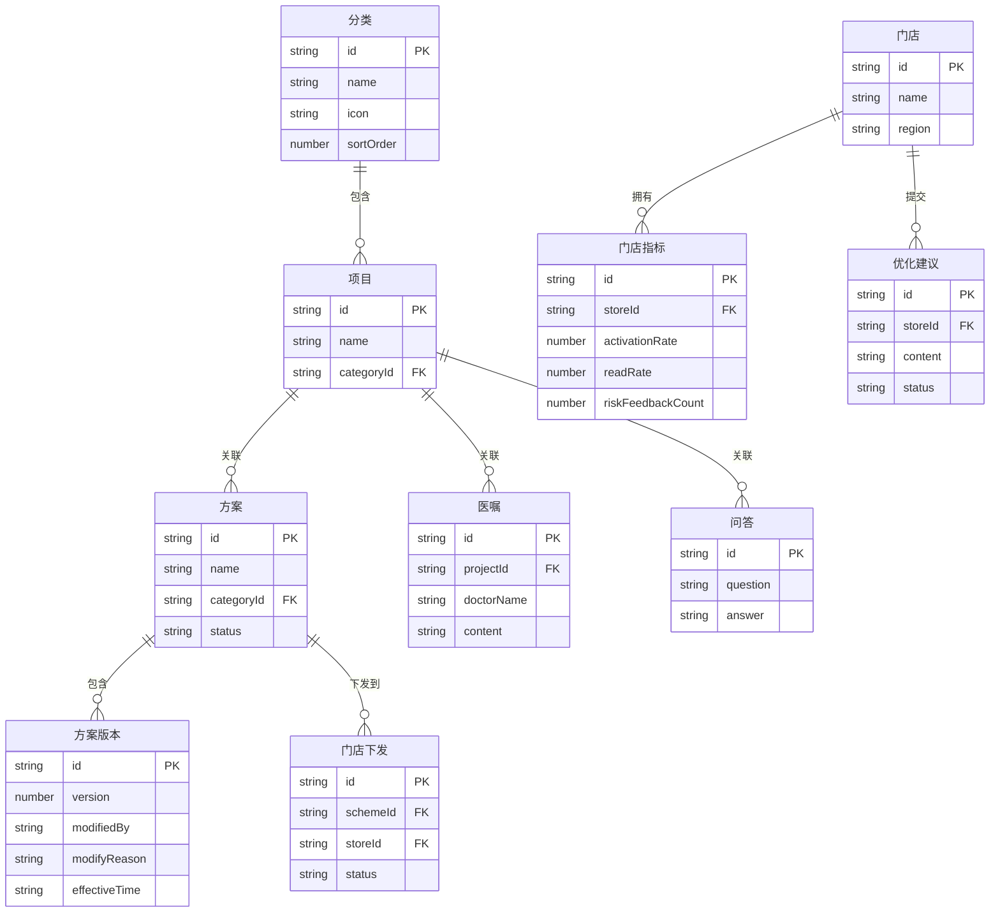

## 1. 架构设计



采用纯前端架构，使用 Mock 数据模拟后端接口，LocalStorage 实现数据持久化。项目为后台管理系统，无需 SEO，适合 SPA 单页应用。

## 2. 技术说明

- 前端：React@18 + Tailwind CSS@3 + Vite
- 初始化工具：Vite (npm create vite@latest)
- 后端：无（使用 Mock 数据）
- 数据库：无（LocalStorage 持久化 + 内存状态管理）
- 路由：React Router v6
- 状态管理：Zustand
- 图表：Recharts
- 图标：Lucide React
- 富文本：React Quill（医嘱编辑器）
- 日期处理：date-fns

## 3. 路由定义

| 路由 | 用途 |
|------|------|
| / | 重定向到方案库 |
| /schemes | 方案库列表页 |
| /schemes/:id | 方案详情/编辑页 |
| /schemes/new | 新建方案页 |
| /categories | 项目分类管理页 |
| /doctor-orders | 医嘱编辑列表页 |
| /doctor-orders/:projectId | 项目医嘱编辑页 |
| /distribution | 门店下发配置页 |
| /distribution/miniapp | 小程序文案配置页 |
| /qa | 问答库列表页 |
| /qa/new | 新建问答 |
| /dashboard | 效果看板页 |

## 4. API 定义（Mock）

### 4.1 方案相关

```typescript
interface Scheme {
  id: string
  name: string
  categoryId: string
  prohibitedFoods: FoodItem[]
  recommendedFoods: FoodItem[]
  reminderFrequency: 'daily' | 'every3days' | 'weekly' | 'custom'
  customFrequency?: string
  recoveryStages: RecoveryStage[]
  specialPopulationNotes: string
  status: 'draft' | 'published' | 'archived'
  versions: SchemeVersion[]
  createdAt: string
  updatedAt: string
}

interface FoodItem {
  id: string
  name: string
  reason: string
  severity: 'high' | 'medium' | 'low'
}

interface RecoveryStage {
  id: string
  name: string
  dayRange: [number, number]
  description: string
  prohibitedFoods: string[]
  recommendedFoods: string[]
}

interface SchemeVersion {
  id: string
  version: number
  modifiedBy: string
  modifyReason: string
  effectiveTime: string
  createdAt: string
}
```

### 4.2 医嘱相关

```typescript
interface DoctorOrder {
  id: string
  projectId: string
  doctorName: string
  content: string
  tags: string[]
  createdAt: string
  updatedAt: string
}
```

### 4.3 门店下发相关

```typescript
interface StoreDistribution {
  id: string
  schemeId: string
  storeIds: string[]
  status: 'pending' | 'active' | 'expired'
  allowRegionalDiff: boolean
  regionalOverrides: Record<string, Partial<Scheme>>
  distributedAt: string
  distributedBy: string
}

interface MiniAppConfig {
  homepageCopy: string
  brandTone: string
  holidayReminders: HolidayReminder[]
}

interface HolidayReminder {
  id: string
  holiday: string
  startDate: string
  endDate: string
  content: string
}
```

### 4.4 问答相关

```typescript
interface QAItem {
  id: string
  question: string
  answer: string
  relatedProjectIds: string[]
  tags: string[]
  createdBy: string
  createdAt: string
  updatedAt: string
}
```

### 4.5 效果看板相关

```typescript
interface StoreMetrics {
  storeId: string
  storeName: string
  activationRate: number
  readRate: number
  riskFeedbackCount: number
  monthlyTrend: MonthlyData[]
}

interface MonthlyData {
  month: string
  activationRate: number
  readRate: number
  riskFeedbackCount: number
}

interface OptimizationSuggestion {
  id: string
  storeId: string
  storeName: string
  submitter: string
  content: string
  relatedSchemeId: string
  status: 'pending' | 'approved' | 'rejected'
  createdAt: string
}
```

## 5. 数据模型

### 5.1 数据模型定义


